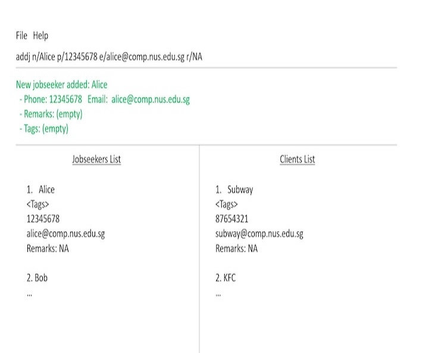

# TalentLink

TalentLink is a desktop application for recruiters to manage job seekers and client companies. It helps recruiters to organise contact details, search/filter candidates and clients, add remarks, and tag contacts according to relevant skills or industries.

## Features
* Add and delete job seekers and company clients
* List all job seekers and company clients
* Search and filter job seekers and company clients
* Add remarks and tags to contacts

## Documentation
* For the detailed documentation of this project, see the **[TalentLink Product Website](https://ay2627s1-cs2103t-f10-4.github.io/tp)**.

## Acknowledgements
This project is based on the AddressBook-Level3 project created by the [SE-EDU initiative](https://se-education.org).